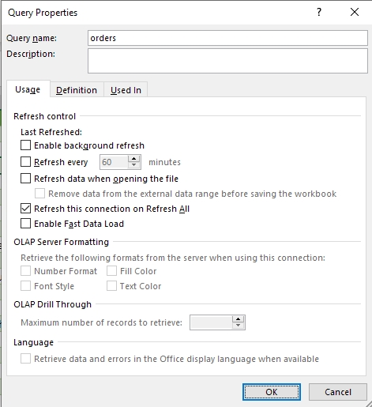

# Win32 Requirement

```
pip install pywin32 # Install Win32 for Python
```

Win32 is a native Windows OS call so this library only available for Windows and it also requires Excel to be installed in Host computer.

# Example Files

The example dashboard `dashboard.xlsx` fetched data dynamically from `orders.csv`. In order to simulate any data updates you can modify `orders.csv` and run the Python script to perform automatic refresh for the dashboard and check whether the updates are reflected corretly in any PowerQuery and PivotTables that exists in the dashboard.

# Notice about PivotTable and Power Query

To make sure all PivotTables that have data source from PowerQuery updated correctly, make sure **DISABLE Enable Background Refresh**.

1. Query > Properties > Enable Background Refresh


